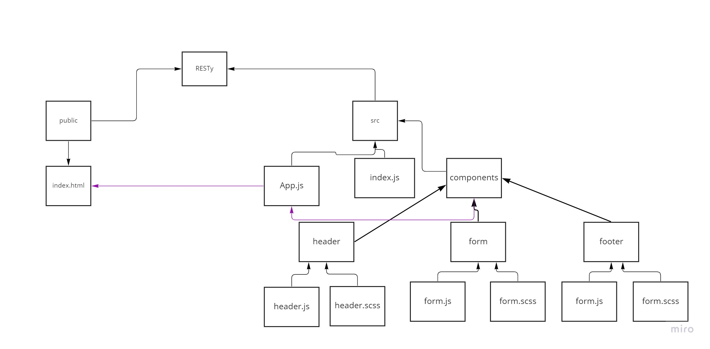
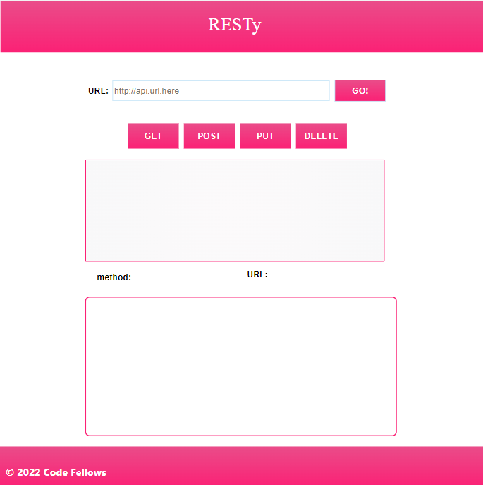

# RESTy App
This application will be an API testing tool that can be run in any browser, allowing a user to easily interact with APIs in a familiar interface.

## phase1:  Application Setup
Basic React Application
Scaffolding
Basic State
Rendering

## phase2: Testing and Deployment
Testing of React components and applications
Uses best practices for testing Behaviors and Acceptance Criteria
Integrates with an online CI framework
Deploy to GitHub Pages, Netlify, and/or AWS

## UML 

## App img At Phase1

## App Img At Phase2

## sandBox linke
[linke for the code](https://codesandbox.io/s/dazzling-shadow-g90cwv?file=/src/components/form/form.js)

## sandBox linke phase2
[linke for the app](https://qxb13h.csb.app/)

[linke for the code](https://codesandbox.io/s/resty-qxb13h)

## pull req
[pull req](https://github.com/hala277/resty/pull/1)

## pull req2
[pull req](https://github.com/hala277/resty/pull/6)

## website linke from netlify
[netlify link](https://6276b09f281d78262fa56f77--fanciful-gnome-e4c501.netlify.app/)
